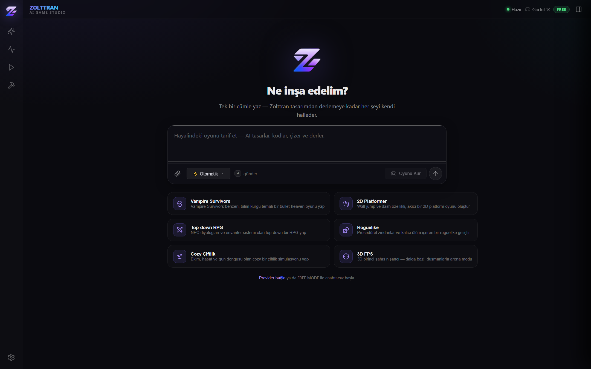
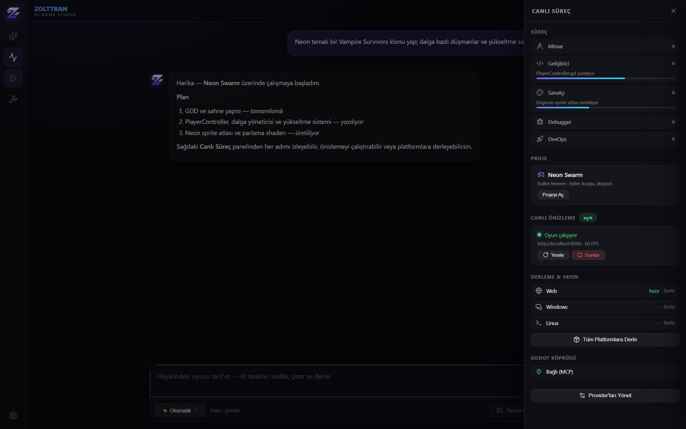
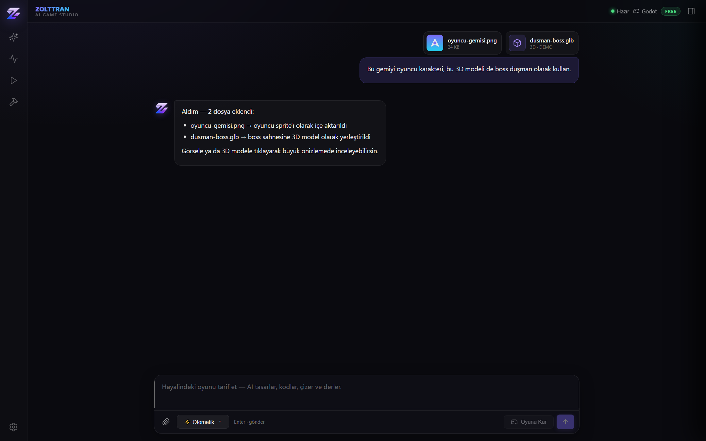
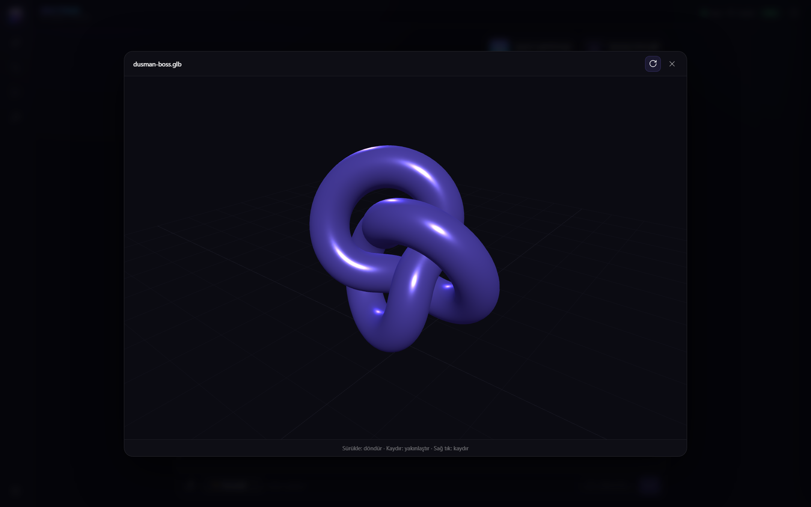
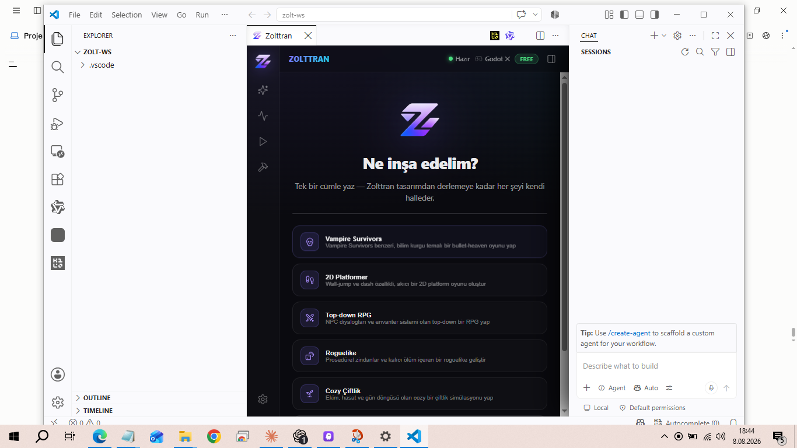

<div align="center">


# Zolttran — AI Game Studio

**Hayal et, Zolttran yapsın.** Tek bir cümleyle oyun üreten, tamamen otonom AI oyun geliştirme aracı.
Godot 4.x ile entegre. Sen sadece konuş — tasarım, kod, sanat, test, derleme ve yayını AI halleder.

[](LICENSE)
[](#-kurulum)
[](https://godotengine.org)

[Kurulum](#-kurulum) · [Özellikler](#-özellikler) · [Kullanım](#-kullanım) · [Yol Haritası](docs/ROADMAP.md)

</div>

---

## 🎬 Ekran Görüntüleri

| Ana ekran | Çalışırken (canlı süreç) |
|---|---|
|  |  |

| Dosya / görsel / 3D ekleme | 3D model görüntüleyici |
|---|---|
|  |  |

VS Code içinde çalışırken:



---

## ✨ Özellikler

- **Tek yüzey, sıfır mod** — sekme yok, mod yok. Sol ikon navigasyonu + tek konuşma yüzeyi + istenince açılan canlı süreç çekmecesi. Sade, hızlı ve havalı.
- **Tam otonom** — kullanıcı sadece provider bağlar; 5 AI agent (Mimar, Geliştirici, Sanatçı, Debugger, DevOps) tüm işi yapar. Her adım canlı rayda görünür, tek tıkla kontrol edilir.
- **Dosya / görsel / 3D ekleme** — composer'dan ataç, sürükle-bırak, yapıştır ile **her tür dosya** (boyut sınırı yok). Sohbette önizleme; görsele tıkla → tam ekran lightbox, 3D modele tıkla → **three.js orbit görüntüleyici** (glb/gltf/obj).
- **25+ AI provider** — OpenRouter, NVIDIA NIM, Anthropic, OpenAI, Google, Groq, DeepSeek, Mistral, xAI, Cohere, Ollama… **FREE MODE** ile API anahtarı olmadan başla.
- **Godot 4.x köprüsü** — MCP + TCP + CLI üçlü bağlantı. Prompt-to-Game: tek cümleden oynanabilir Godot projesi.
- **Çok platform** — Web, Windows, macOS, Linux, Android, iOS export; tek tıkla derleme.
- **Çapraz-platform temeli** — tek hesap → çok platform (iOS + Android aynı oyun/oturum), çalışan WebSocket relay + otomatik `update.json` üretimi. Durum & sınırlar: [ROADMAP](docs/ROADMAP.md).

---

## 📦 Kurulum

### Yol A — Hazır paketten (.vsix)

```bash
code --install-extension zolttran-1.0.0.vsix
```

Veya VS Code içinde: **Extensions** panelinde `···` → **Install from VSIX…** → `zolttran-1.0.0.vsix`.

### Yol B — Kaynaktan derle

```bash
cd extension
npm install
npm run build
```

Ardından VS Code'da <kbd>F5</kbd> (Extension Development Host) ile çalıştır, ya da `.vsix` üret ve kur.

### Açma

- Klavye: <kbd>Ctrl</kbd>+<kbd>Shift</kbd>+<kbd>Z</kbd>
- Komut paleti: **Zolttran: Paneli Aç**

---

## 🚀 Kullanım

1. Paneli aç. **FREE MODE** varsayılan açık — hemen başla (ya da ⚙️ ile kendi provider'ını bağla).
2. Ortadaki alana oyununu **tek cümleyle** tarif et: _"Neon temalı bir Vampire Survivors klonu yap"_.
3. **Gönder** ile sohbet et; **🎮 Oyunu Kur** ile tam pipeline'ı başlat.
4. Sağdaki **Canlı Süreç** çekmecesinden agent'ları izle, önizlemeyi çalıştır, platformlara derle.
5. Görsel/3D model sürükle-bırak — AI projene dahil eder; tıklayınca büyük önizlemede incele.

---

## 🛠️ Teknik

TypeScript 5 · React 18 · Zustand · Vite 6 · esbuild · three.js · Tailwind · `ws` · Godot 4.x · Apache-2.0

## 📄 Lisans

Apache License 2.0 — bkz. [LICENSE](LICENSE).
