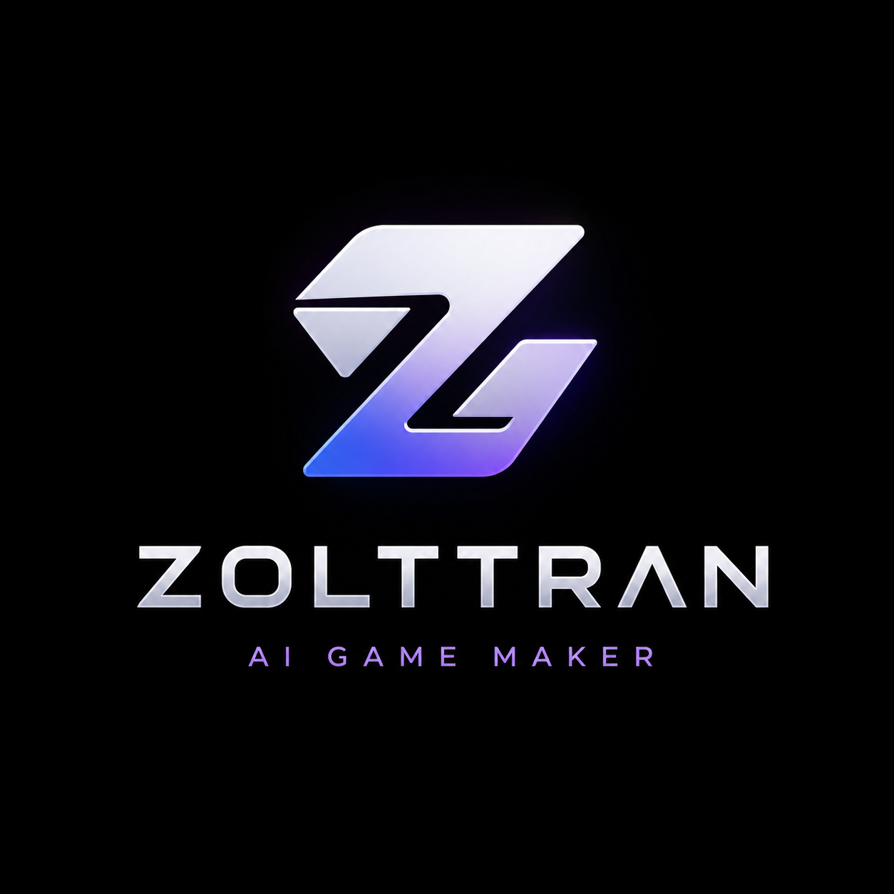
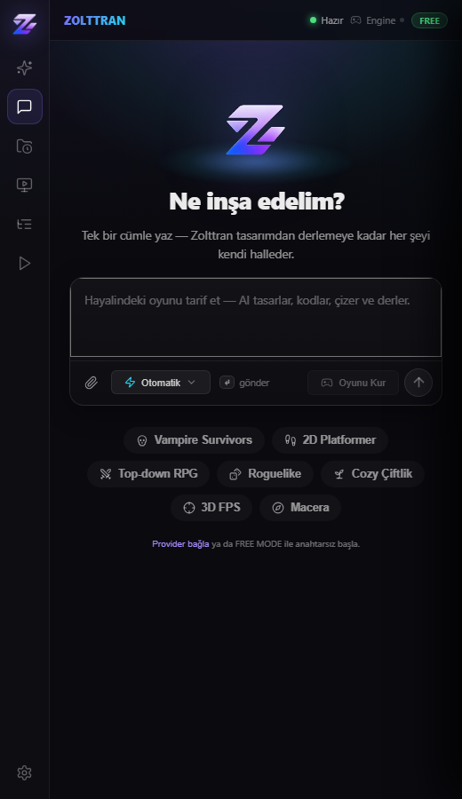
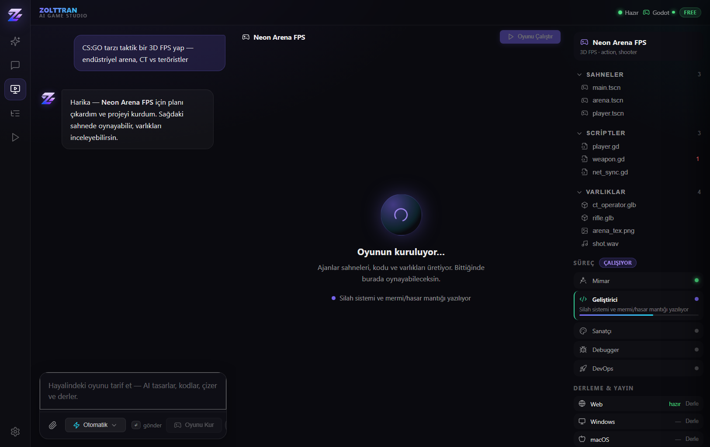
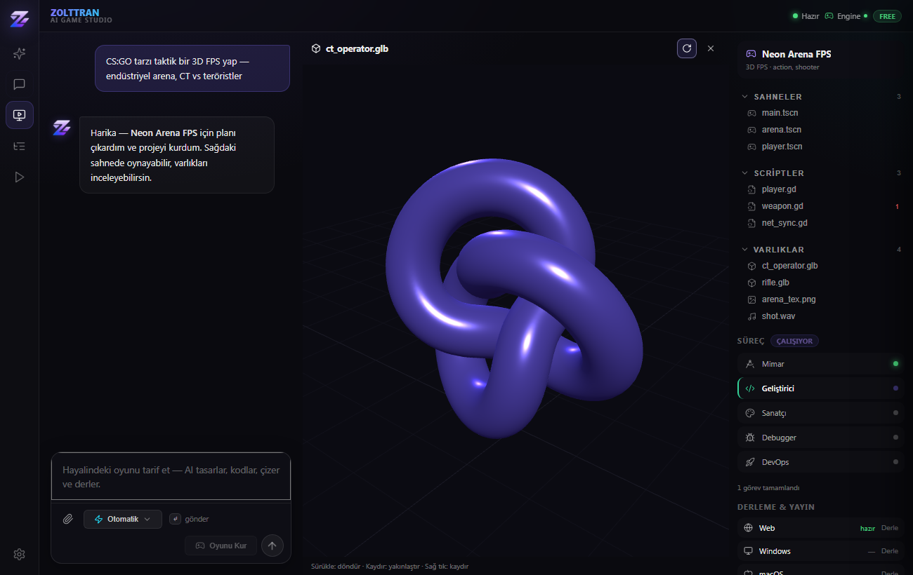
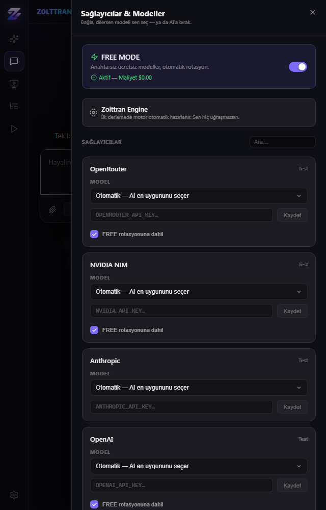

<div align="center">



# Zolttran — AI Game Studio

**Hayal et, Zolttran yapsın.** Tek bir cümleden gerçekten oynanabilir Godot 4 oyunları — VS Code içinde, tamamen ücretsiz başlanabilen bir yapay zekâ oyun geliştirme aracı.

`v0.0.10` · Godot 4.3 ile uçtan uca doğrulandı · FREE MODE (anahtarsız) · MCP destekli

[](LICENSE)

</div>

---

## Ne yapar?

Bir oyun fikrini yazarsın; Zolttran türü sezer, bir **yapım planı** çıkarır, onayınla **gerçek Godot 4 projesi** üretir (GDScript + sahneler + export ayarları), sağdaki sahnede **web'de oynatır**. API anahtarı gerekmez — offline üretim tamamen yereldir.

> **Not:** Bu araç aktif geliştirme aşamasındadır (`0.0.x`). Aşağıdaki her şey gerçek Godot 4.3 ile test edilmiştir, ama olgunlaşmaya devam ediyor.

---

## Ekran görüntüleri

### Ana ekran — tek cümleyle başla


### 3-bölge Studio — sohbet · canlı sahne · varlık ağacı


### Studio içi interaktif 3D model önizleme


### Sağlayıcı & model paneli — kendi modelini seç ya da AI'a bırak


---

## Özellikler

- **Tek cümleyle oyun** — prompt → tür sezimi → yapım planı → oynanabilir Godot 4 projesi (offline, anahtarsız).
- **8 oyun kategorisi** — Bullet-Heaven, 2D Platformer, Top-down RPG, 3D FPS, Roguelike, Çiftlik Sim, Strateji, Macera. Her biri gerçek hareket/fizik/AI/mekanik kodu üretir.
- **3-bölge Studio** — sol sohbet · orta canlı oynanabilir önizleme · sağ varlık/sahne ağacı + süreç + derleme hedefleri.
- **Studio içi 3D önizleme** — `.glb/.gltf/.obj` modelleri döndürülebilir/yakınlaştırılabilir olarak gösterir (three.js).
- **Zolttran Engine (otonom)** — Godot motoru ve export şablonları ilk kullanımda otomatik indirilip kurulur; kullanıcı motor kurulumuyla hiç uğraşmaz.
- **FREE MODE** — anahtarsız ücretsiz modeller, otomatik rotasyon. İstersen kendi sağlayıcı/model'ini seçer, provider bazında FREE rotasyonundan çıkarabilirsin.
- **Projelerim** — ürettiğin oyunlar geçmişte birikir, tek tıkla geri açılır.
- **Çok-platform export** — Web + Windows + Linux doğrudan; macOS/Android/iOS için export ayarları hazır (son derleme ilgili platform araç zincirini ister).
- **MCP sunucusu** — Zolttran'ın üretim yeteneklerini Claude Code / Codex gibi MCP istemcilerine açar.

---

## Kurulum

1. En son `.vsix` dosyasını indir (Releases) veya depodan derle.
2. VS Code → Extensions → `...` menüsü → **Install from VSIX…**
3. VS Code'u **tamamen kapatıp aç**.
4. Sol aktivite çubuğundaki **Z** ikonuna tıkla.
5. Bir oyun tarif et → **Oyunu Kur** → planı onayla → **Oyunu Çalıştır**.

İlk derlemede Zolttran Engine (Godot 4.3 + export şablonları) otomatik hazırlanır — onay vermen yeterli.

### Kaynaktan derleme
```bash
cd extension
npm install
npm run build      # ext + ui + mcp
```

---

## MCP entegrasyonu (Claude Code / Codex)

Zolttran'ın oyun üretim araçlarını başka bir AI aracına bağla. Eklentide **"Zolttran: MCP Yapılandırmasını Kopyala"** komutu gerçek yolla config'i panoya verir:

```json
{
  "mcpServers": {
    "zolttran": {
      "command": "node",
      "args": ["<eklenti-yolu>/dist/mcp-server.js"]
    }
  }
}
```

Sağlanan araçlar:
- `zolttran_generate_game` — prompttan tam oynanabilir Godot projesi üretir.
- `zolttran_detect_game_type` — tür + yapım planı döndürür (yazmadan).
- `zolttran_list_templates` — desteklenen kategorileri listeler.

---

## Doğrulama durumu

Gerçek **Godot 4.3-stable** ile test edildi:

| Aşama | Sonuç |
|---|---|
| 8 kategori — proje üretimi | ✓ |
| Godot import (parse) | ✓ 8/8 temiz |
| Ana sahne runtime | ✓ 8/8 temiz |
| Web export (HTML5) | ✓ 2D + 3D oynanabilir build |
| Windows / Linux export | ✓ |
| macOS / Android / iOS | Export config hazır; son derleme ilgili araç zincirini ister |

---

## Yol haritası

- [ ] Üretilen oyunlarda daha zengin görsel varlıklar (sprite/mesh) ve daha derin mekanikler
- [ ] Ayrı, Tesana-benzeri standalone web uygulaması (eklentiden bağımsız)
- [ ] Android/iOS için tam otomatik araç zinciri kurulumu
- [ ] Daha fazla oyun kategorisi ve şablon

---

<div align="center">

**ZOLTTRAN** · Hayal et, Zolttran yapsın.

</div>
